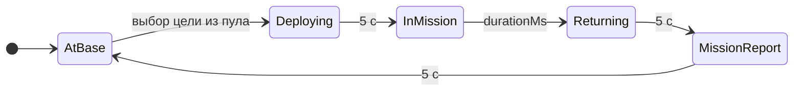
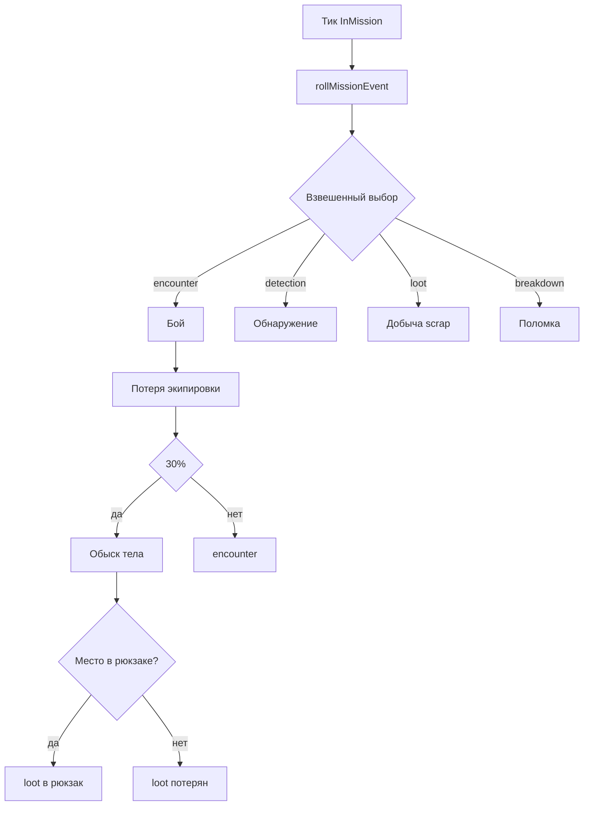
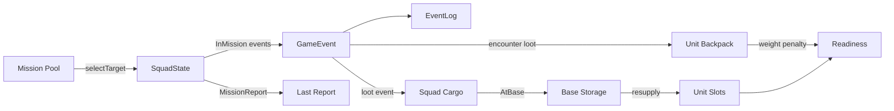

# PAWS — дизайн-документ игровых механик

**Дата:** 2026-05-31  
**Статус:** Отражает текущую реализацию (`packages/core`)  
**Версия прототипа:** multi-squad + mission pool + personal inventory

## Обзор

**PAWS** (NINE LIVES CORP) — idle-тактический прототип: игрок наблюдает за автономными отрядами, которые циклически выезжают на миссии, переживают случайные события, возвращаются на базу и пополняют снаряжение. Управление минимально — пауза и скорость симуляции.

**Ключевой опыт:** открыть браузер → три отряда KOBRA работают параллельно → события в логе → отчёт после миссии → resupply → повтор.

### Не входит в текущую версию

- Сохранение/загрузка
- Команды игрока (`PlayerCommand = never`)
- Ручной выбор цели, доктрины, экипировки
- Drag-and-drop инвентаря
- Тактический бой на тайлах
- Rust/WASM (архитектура готова, реализация — TypeScript)

---

## Архитектура

```
paws-prototype/
  packages/
    core/     @paws/core — чистая симуляция, без DOM
    ui/       @paws/ui   — React + Canvas
```

### API ядра


| Метод                   | Описание                                           |
| ----------------------- | -------------------------------------------------- |
| `createGame({ seed? })` | Создаёт игру с детерминированным RNG               |
| `game.tick(dtMs)`       | Накапливает время, шагает симуляцию с шагом 100 ms |
| `game.getState()`       | JSON-сериализуемый снимок `GameState`              |
| `game.setPlaying(bool)` | Пауза/возобновление                                |
| `game.setSpeed(n)`      | Множитель скорости                                 |


**Детерминизм:** `seed` + число тиков → воспроизводимый `eventLog` (покрыто тестами).

---

## Игровой цикл




Каждый отряд проходит FSM **независимо**. Три отряда работают параллельно на одной карте и делят общий пул целей и склад базы.

### Фазы и длительности


| Фаза              | Длительность                     | Что происходит                                      |
| ----------------- | -------------------------------- | --------------------------------------------------- |
| **AtBase**        | 15 с (+5 с если readiness < 80%) | Сдача груза на склад, resupply слотов, сброс миссии |
| **Deploying**     | 5 с                              | Движение к цели, `missionProgress` 0→1              |
| **InMission**     | Зависит от типа (25–60 с)        | Случайные события каждые ~8 с                       |
| **Returning**     | 5 с                              | Возврат на HQ                                       |
| **MissionReport** | 5 с                              | Формирование отчёта, показ в UI                     |


---

## Отряды и юниты

### Отряды (squads)


| ID      | Доктрина | Состав                       |
| ------- | -------- | ---------------------------- |
| KOBRA-1 | ASSAULT  | Medic + Engineer + Scout     |
| KOBRA-2 | RECON    | Medic + Engineer + Scout     |
| KOBRA-3 | SALVAGE  | Medic + Engineer + Geologist |


**Доктрина** определяет:

1. Приоритет выбора цели из пула миссий
2. Веса событий во время миссии (см. «Известные особенности»)

### Юниты


| ID        | Имя          | Роль      | Слоты                                          |
| --------- | ------------ | --------- | ---------------------------------------------- |
| medic     | DOC WHISKERS | Medic     | weapon (smg), armor (light_armor), medkit      |
| engineer  | WRENCH       | Engineer  | weapon (shotgun), armor (light_armor), toolkit |
| scout     | SHADOW       | Scout     | weapon (smg), armor (cloak), scanner           |
| geologist | CORE         | Geologist | weapon (shotgun), armor (light_armor), drill   |


Каждый юнит имеет:

- **slots** — экипировка (3 слота, шаблон фиксирован)
- **backpack** — личный рюкзак (до 5 уникальных `itemId`)
- **weight** — вычисляемый вес рюкзака

### Груз отряда

`squad.cargo` — общий груз отряда (сейчас используется только для scrap с лут-событий). При возвращении на базу сливается в `baseStorage`.

---

## Карта и пул миссий

### Точки интереса (POI)


| ID      | Название      | Координаты |
| ------- | ------------- | ---------- |
| hq      | NINE LIVES HQ | (120, 380) |
| mines   | OLD MINES     | (280, 120) |
| bay7    | BAY-7 STATION | (520, 200) |
| reactor | REACTOR SITE  | (680, 320) |
| depot   | FIELD DEPOT   | (400, 420) |


Карта 800×500 px. POI (кроме HQ) связаны рёбрами для отображения.

### Пул целей (mission pool)

- Размер: **4 цели** (по одной на каждый POI, кроме HQ)
- Каждая цель привязана к POI и имеет **случайный тип миссии**
- Веса генерации: PATROL 35%, RECON 25%, SALVAGE 25%, ASSAULT 15%
- При опустошении пула — автоматическая регенерация

### Выбор цели

При переходе в `Deploying` отряд выбирает цель по **цепочке приоритетов доктрины**:


| Доктрина | Приоритет (первый → последний)     |
| -------- | ---------------------------------- |
| ASSAULT  | ASSAULT → RECON → SALVAGE → PATROL |
| RECON    | RECON → SALVAGE → ASSAULT → PATROL |
| SALVAGE  | SALVAGE → PATROL → RECON → ASSAULT |
| PATROL   | PATROL → SALVAGE → RECON → ASSAULT |


Выбранная цель удаляется из пула. Координаты и `durationMs` записываются в состояние отряда.

---

## Типы миссий

`MissionType` = `Doctrine`: **PATROL**, **RECON**, **SALVAGE**, **ASSAULT**.


| Тип     | Длительность | penaltyPercent | Множитель лута | Частота событий |
| ------- | ------------ | -------------- | -------------- | --------------- |
| PATROL  | 30 с         | 5%             | ×0.5           | ×0.8            |
| RECON   | 45 с         | 10%            | ×1.0           | ×1.0            |
| SALVAGE | 25 с         | 3%             | ×3.0           | ×0.6            |
| ASSAULT | 60 с         | 15%            | ×2.0           | ×1.5            |


### Что такое penaltyPercent («штраф encounter»)

`penaltyPercent` — **номинальная оценка риска боя** для типа миссии. Значение попадает только в текст события encounter:

> «DOC WHISKERS took fire — lost medkit **(10% penalty)**»

**На механику сейчас не влияет:** readiness не уменьшается на эти проценты, других расчётов от `penaltyPercent` нет.

Реальный эффект encounter — **потеря предмета из слота** (armor или consumable). Readiness падает косвенно: пустой слот не засчитывается при пересчёте готовности. Чем выше `penaltyPercent` у типа, тем опаснее считается миссия в лоре и тем чаще там бывают encounter (см. веса ниже).

### Веса событий по типу


| Тип     | encounter | detection | loot | breakdown |
| ------- | --------- | --------- | ---- | --------- |
| PATROL  | —         | —         | 40%  | 60%       |
| RECON   | 30%       | 30%       | 30%  | 10%       |
| SALVAGE | 10%       | 10%       | 70%  | 10%       |
| ASSAULT | 50%       | —         | 20%  | 30%       |


---

## События миссии

Каждые **8 секунд** (`EVENT_INTERVAL_MS`) во время `InMission` бросается одно событие через взвешенный случайный выбор.




### encounter (бой)

- Случайный боец теряет предмет из слота: **armor** или **consumable** (medkit, toolkit, scanner)
- В сообщении указывается `penaltyPercent` типа миссии — это **только flavor-текст**, не числовой штраф (см. выше)
- Фактическое снижение readiness — через потерю экипировки при пересчёте слотов
- **30% шанс** после боя → обыск тела (`scavengeBody`) вместо обычного encounter

### scavengeBody (обыск тела)

Таблица `BODY_LOOT_TABLE`:


| Предмет        | Шанс | Кол-во |
| -------------- | ---- | ------ |
| ammo           | 25%  | 1–3    |
| medkit         | 15%  | 1–3    |
| materials      | 20%  | 1–3    |
| scrap          | 20%  | 1–3    |
| fuel           | 10%  | 1–3    |
| empty (ничего) | 10%  | —      |


Лут идёт в **рюкзак случайного бойца**. Если рюкзак полон (5 уникальных предметов) — лут теряется.

### loot (добыча)

- Всегда **scrap** в `squad.cargo`
- Базовое кол-во: 1–3, умножается на `lootMultiplier` типа миссии

### breakdown (поломка)

- Случайный боец теряет **consumable** (medkit, toolkit, scanner) или любой занятый слот

### detection (обнаружение)

- Только в RECON и SALVAGE
- Если у юнита есть **cloak** и RNG > 50% → уклонение, без потерь
- Иначе — обнаружение без потерь readiness (только запись в лог)

---

## Readiness (готовность)

Readiness = **процент заполненных слотов** по шаблону экипировки (0–100%) минус штраф за вес рюкзаков.

### Расчёт

1. Для каждого юнита: сколько слотов содержат **ожидаемый** `itemId` из шаблона
2. `baseReadiness = (filled / total) × 100`
3. Штраф за вес всех рюкзаков отряда:


| Суммарный вес | Штраф |
| ------------- | ----- |
| ≤ 8           | 0     |
| 9–12          | −5    |
| > 12          | −15   |


### Веса предметов


| Предмет             | Вес |
| ------------------- | --- |
| ammo, medkit, scrap | 1   |
| materials, fuel     | 2   |


### Влияние readiness

- **< 80%** при возвращении на базу → resupply продлевается на **+5 с**
- **> 20%** после миссии → outcome `success`, иначе `partial`
- Outcome `failed` определён в типах, но пока не используется

---

## База и resupply

### Стартовый склад


| Предмет   | Кол-во |
| --------- | ------ |
| ammo      | 200    |
| medkit    | 10     |
| toolkit   | 5      |
| drill     | 3      |
| fuel      | 80     |
| materials | 120    |
| scrap     | 0      |


### При возвращении (фаза AtBase)

1. **depositCargoToBase** — весь `squad.cargo` → `baseStorage`
2. **resupplySquad** — для каждого пустого/повреждённого слота: взять 1 шт. нужного `itemId` со склада
3. Если readiness < 80% — дополнительная пауза 5 с

Рюкзаки бойцов **не** очищаются автоматически на базе.

---

## Отчёт о миссии (MissionReport)

Формируется при входе в фазу `MissionReport`:


| Поле                    | Описание                                  |
| ----------------------- | ----------------------------------------- |
| outcome                 | `success` (readiness > 20%) или `partial` |
| durationMs              | Фактическое время миссии                  |
| readinessBefore / After | Readiness до и после                      |
| events                  | Все события миссии                        |
| lootGained              | Прирост в `squad.cargo` (scrap)           |
| itemsLost               | Потерянные предметы экипировки            |
| bodyLoot                | Лут с тел (из сообщений «scavenged body») |


---

## Симуляция


| Параметр           | Значение               |
| ------------------ | ---------------------- |
| TICK_STEP_MS       | 100 ms                 |
| EVENT_INTERVAL_MS  | 8000 ms                |
| EVENT_LOG_MAX      | 20 записей             |
| BACKPACK_CAPACITY  | 5 уникальных предметов |
| MAP_WIDTH × HEIGHT | 800 × 500              |


RNG: детерминированный PRNG от `seed`. При регенерации пула используется `seed + Date.now()` (недетерминированно).

---

## UI

React-приложение с Canvas-картой. Игрок может:

- **Пауза / Play**
- **Смена скорости** (1×, 2×, 4×)
- Просмотр: карта, отряды, цели, лог событий, отчёт миссии, склад базы

Все остальные элементы интерфейса (вкладки, кнопки команд) — заглушки.

---

## Известные особенности реализации

1. `**penaltyPercent`** — только текст в логе encounter, не применяется к readiness или другим stat.
2. `**eventRateModifier`** из конфига типа миссии **не используется** при расчёте интервала событий (интервал фиксирован 8 с).
3. `**MISSION_POOL_SIZE`** (4) не ограничивает генерацию — пул всегда равен числу POI (4).
4. Outcome `**failed`** есть в типе, но не выставляется в коде.

---

## Диаграмма потока данных




---

## Связанные документы

- MVP spec: `docs/superpowers/specs/2026-05-23-minimal-mvp-design.md`
- Multi-squad + pool: `docs/superpowers/plans/2026-05-25-multi-squad-mission-pool.md`
- Personal inventory: `docs/plans/2026-05-25-personal-inventory-design.md`

